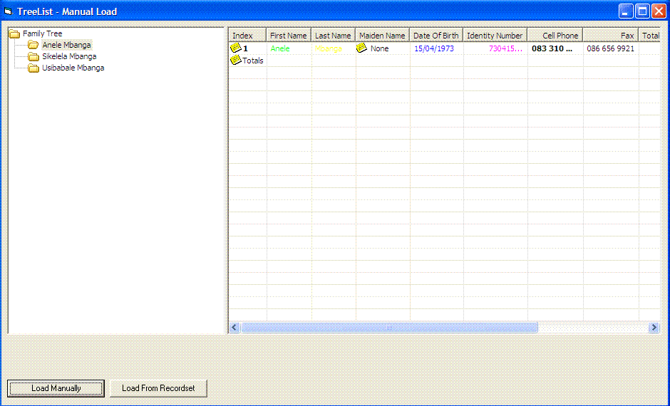



## TreeList

### Description

This is a consolidation of the tree view and list view control as an activex control. You can load nodes into the treeview that will be linked to the list view. When a linked node is clicked on the tree view, the corresponding list view items are shown on the list view with the defined columns. You can specify the names of the columns to be right aligned and columns to be summed and these will be presented as chosen. The tree view nodes with the corresponding listview items can be loaded manually or from a recordset or table. The listview items can be made bold, color coded etc, see the screenshot. This control has been built for reporting purposes however all the events of both the tree view and the list view have been added to the controls, thus meaning that you can also write code that will trap such event and control the rest of your code. If you like, please vote for me.
 
### More Info
 

             |
---                |---
**Submitted On**   |2008-07-30 14:04:04
**By**             |[Anele Mbanga](https://github.com/Planet-Source-Code/PSCIndex/blob/master/ByAuthor/anele-mbanga.md)
**Level**          |Advanced
**User Rating**    |4.3 (13 globes from 3 users)
**Compatibility**  |VB 6\.0
**Category**       |[Custom Controls/ Forms/  Menus](https://github.com/Planet-Source-Code/PSCIndex/blob/master/ByCategory/custom-controls-forms-menus__1-4.md)
**World**          |[Visual Basic](https://github.com/Planet-Source-Code/PSCIndex/blob/master/ByWorld/visual-basic.md)
**Archive File**   |[TreeList212239812008\.zip](https://github.com/Planet-Source-Code/anele-mbanga-treelist__1-70909/archive/master.zip)

